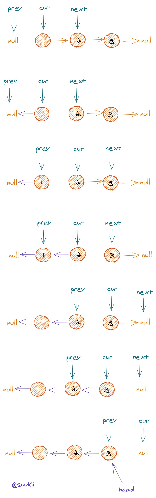
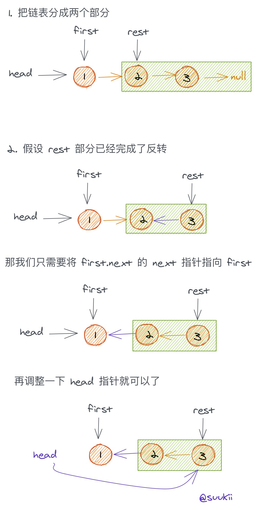

# 206. 反转链表

## 题目

反转一个单链表。

## 示例

```text
输入: 1->2->3->4->5->NULL
输出: 5->4->3->2->1->NULL
```

## 思路
### 思路1: 循环
* 初始化一个 `prev` 指针为 null，一个 `cur` 指针为 head
* 开始遍历链表，在每一次循环中:
    * 先保存 `cur.next`
    * 把 `cur.next` 倒转方向指向 `prev`
    * `prev` 和 `cur` 都分别往前一步



### 思路2: 递归
我们可以把链表分成两个部分:
* 第一个节点
* 余下的部分

假设余下的部分是已经反转好的链表，那我们就只需要把这部分的最后一个节点指向原本的第一个节点，然后返回余下部分的 head。

而余下的部分也可以进一步分成两个部分：

* 第一个节点
* 余下的部分
* ......

这样我们应该就能看到一个递归的套路了，就是把一个大问题一步步地拆分成越来越小的小问题，然后从最小的问题开始一个个往上解决，等把所有小问题都解决了，原本的大问题也就解决了。

那关键点就在于我们得找到可以被直接解决的最小问题，也就是递归的出口。在这道题目中，很明显这个最小问题就是当链表被分成只剩下最后一个节点的时候，我们只需要直接返回当前节点作为 head。

**步骤:**
* 改变当前节点的下一个节点的next指针，指向当前节点
* 当前节点的next指针，指向NULL，保证上一次递归出去的时候，能返回head


