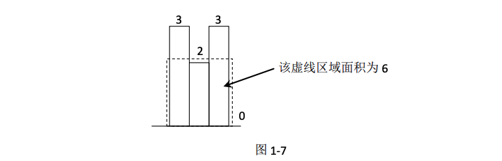

# 最大子矩阵大小


## 题目
给定一个整型矩阵 `map`，其中的值只有 0 和 1 两种，求其中全是 1 的所有矩形区域中，最
大的矩形区域为 1 的数量。
例如：
```
1 1 1 0
```
其中，最大的矩形区域有 3 个 1，所以返回 3。

再如：

```
1 0 1 1
1 1 1 1
1 1 1 0
```

其中，最大的矩形区域有 6 个 1，所以返回 6。


## 难度
3颗星


## 要求
如果矩阵大小为O(NxM)，时间复杂度: O(NxM)


## 解题思路

### Step 1: 计算每行为底的 `height` 高度数组
1.矩阵的行数为 N，以每一行做切割，统计以当前行作为底的情况下，每个位置往上的 1 的数量。使用高度数组 height 来表示。

例如：

```
map = 1 0 1 1
      1 1 1 1
      1 1 1 0
```

height[j] 表示在目前的底（第 1 行）的 j 位置往上（包括 j 位置），有多少个连续的 1。

```
height[j] = map[i][j]==0 ? 0 : height[j]+1
```

* 以第1行切割: height={1, 0, 1, 1}
* 以第2行切割: height={2, 1, 2, 2}
* 以第3行切割: height={3, 2, 3, 0}

### Step 2: 计算 `height` 数组的最大矩形

对于每一次切割，都利用更新后的 height 数组来求出以当前行为底的情况下，最大的矩形是什么。那么这么多次切割中，最大的那个矩形就是我们要的答案。

#### 思路

对于 `height` 数组，读者可以理解为一个直方图，比如{3,2,3,0}，其实就是如图 1-7 所示的直方图。



步骤 2 的实质是在一个大的直方图中求最大矩形的面积。

如果我们能够求出以每一根柱子扩展出去的最大矩形，那么其中最大的矩形就是我们想找的。比如：
* 第 1 根高度为 3 的柱子向左无法扩展，它的右边是 2，比 3 小，所以向右也无法扩展， 则以第 1 根柱子为高度的矩形面积就是 3*1==3；
* 第 2 根高度为 2 的柱子向左可以扩 1 个距离，因为它的左边是 3，比 2 大；右边的柱子也是3，所以向右也可以扩1个距离，则以第2根柱子为高度的矩形面积就是2*3==6；
* 第 3 根高度为 3 的柱子向左没法扩展，向右也没法扩展，则以第 3 根柱子为高度的矩形面积就是 3*1==3；
* 第 4 根高度为 0 的柱子向左没法扩展，向右也没法扩展，则以第 4 根柱子为高度的矩形面积就是 0*1==0；


### 实质
**考查每一根柱子最大能扩多大，这个行为的实质就是找到柱子左边离它最近且比它小的柱子位置在哪里，以及右边离它最近且比它小的柱子位置在哪里。**

#### 问: 这个过程怎么计算最快呢？
答: 利用单调栈，这个内容请读者先阅读本书的“单调栈结构”问题，并彻底理解该结构。


### 举例说明
以 
```
height={3,4,5,4,3,6}
```
为例说明如何根据 height 数组求其中的最大矩形。

具体过程如下：
* 1.生成一个栈，记为 `stack`，从左到右遍历 height 数组，每遍历一个位置，都会把位置压进 `stack` 中。
* 2.遍历到 `height` 的 0 位置，height[0]=3，此时 `stack` 为空，直接将位置 0 压入栈中，此时 `stack` 从栈顶到栈底为 {0}。
* 3.遍历到 `height` 的 1 位置，height[1]=4，此时 `stack` 的栈顶为位置 0，值为 height[0]=3，又有 height[1]>height[0]，那么将位置 1 直接压入 `stack`。
> 这一步体现了遍历过程中的一个关键逻辑: 只有当前 i 位置的值 height[i]大于当前栈顶位置所代表的值（height[stack.peek()]），则 i 位置才可以压入 stack。
> 所以可以知道，stack 中从栈顶到栈底的位置所代表的值是依次递减，并且无重复值，此时stack 从栈顶到栈底为{1,0}。

* 4.遍历到 `height` 的 2 位置，height[2]=5，与步骤 3 的情况完全一样，所以直接将位置 2 压入 `stack`，此时 `stack` 从栈顶到栈底为{2,1,0}。
* 5.遍历到 `height` 的 3 位置，height[3]=4，此时 `stack` 的栈顶为位置 2，值为 height[2]=5，又有height[3]<height[2]。
  
此时又出现了一个遍历过程中的关键逻辑，即如果当前i位置的值height[i]小于或等于当前栈顶位置所代表的值（height[stack.peek()]），则把栈中存的位置不断弹出，直到某一个栈顶所代表的值小于 height[i]，再把位置 i 压入.
并在这期间做如下处理：
* 1.假设当前弹出的栈顶位置记为位置 j，弹出栈顶之后，新的栈顶记为 k。然后开始考虑位置 j 的柱子向右和向左最远能扩到哪里。
* 2.对位置 j 的柱子来说，向右最远能扩到哪里呢？
    * 如果 height[j]>height[i]，那么 i-1 位置就是向右能扩到的最远位置。j 之所以被弹出，就是因为遇到了第一个比 j 位置值小的位置。
    * 如果 height[j]==height[i]，那么 i-1 位置不一定是向右能扩到的最远位置，只是起码能扩到的位置。
  
>**那怎么办呢？**
>
>可以肯定的是，在这种情况下，i 位置的柱子向左必然也可以扩到 j 位置。也就是说，j 位置的柱子扩出来的最大矩形和 i 位置的柱子扩出来的最大矩形是同一个。
>
>所以，此时 j 位置的柱子能扩出来的最大矩形虽然无法被正确计算，但不要紧，因为 i 位置肯定要压入到栈中，那么 j 位置和 i 位置共享的最大矩形就等 i 位置弹出的时候再计算即可。

* 3.对位置 j 的柱子来说，向左最远能扩到哪里呢？
> 根据单调栈的性质，k 位置的值是 j 位置的值左边离 j 位置最近的比 j 位置的值小的位置，所以 j 位置的柱子向左最远可以扩到 k+1 位置。

* 4.综上所述，j 位置的柱子能扩出来的最大矩形为 (i-k-1)*height[j]
  
```
为什么是 i-k-1?

向左最远能扩的位置: k+1
向右最远能扩的位置: i-1
(i-1) - (k+1) + 1 = i - k - 1
```

