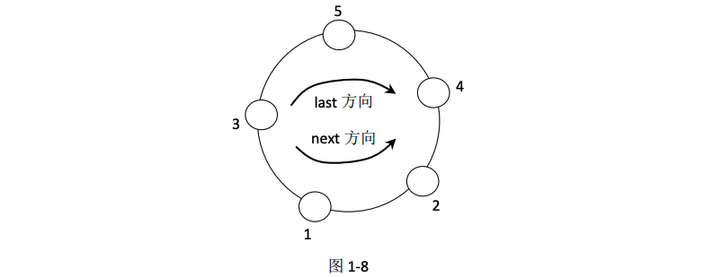
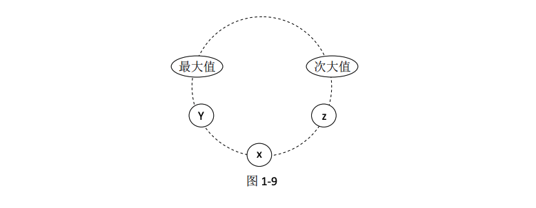

# 可见山峰的数量

## 题目
一个不含有负数的数组可以代表一圈环形山，每个位置的值代表山的高度。比如: {3,1,2,4,5}、{4,5,3,1,2} 或 {1,2,4,5,3} 都代表同样结构的环形山。

* 3->1->2->4->5->3 方向叫作 next 方向（逆时针）
* 3->5->4->2->1->3 方向叫作 last 方向（顺时针）

如图 1-8 所示。



**山峰 A 和山峰 B 能够相互看见的条件为:**
* 1.如果 A 和 B 是同一座山，认为不能相互看见。
* 2.如果 A 和 B 是不同的山，并且在环中相邻，认为可以相互看见。比如图 1-8 中，相邻的山峰对有(1,2)(2,4)(4,5)(3,5)(1,3)。
* 3．如果 A 和 B 是不同的山，并且在环中不相邻，假设两座山高度的最小值为 min。
  
如果 A 通过 next 方向到 B 的途中没有高度比 min 大的山峰，或者 A 通过 last 方向到 B 的途中没有高度比 min 大的山峰，认为 A 和 B 可以相互看见。

比如图 1-8 中，高度为 3 的山和高度为 4 的山， 两座山的高度最小值为 3。 
* 3 从 last 方向走向 4，中途会遇见 5，所以 last 方向走不通。
* 3 从 next 方向走向 4，中途会遇见 1 和 2，但是都不大于两座山高度的最小值 3，所以 next 方向可以走通。


有一个能走通就认为可以相互看见。再如，高度为 2 的山和高度为 5 的山，两个方向上都走不通，所以不能相互看见。

图 1-8 中所有在环中不相邻，并且能看见的山峰对有(2,3)(3,4)。

给定一个不含有负数且没有重复值的数组 arr，请返回有多少对山峰能够相互看见。


## 解题思路: 原题目
### 时间复杂度 O(1)的解
如果数组中所有的数字都不一样，可见山峰对的数量可以由简单公式得到。
* 环形结构中只有 1 座山峰时，可见山峰对的数量为 0；环形结构中只有 2 座山峰时，可见山峰对的数量为 1。这都是显而易见的。
* 环形结构中有 i 座山峰时（i>2），可见山峰对的数量为 2×i-3。

### 证明  
下面给出证明:

**我们只用高度小的山峰去找高度大的山峰，而永远不用高度大的山峰去找高度小的山峰。**

比如题目描述中的例子，从 2 出发按照“小找大”原则，会找到(2,3)和(2,4)，但是不去尝试 2 能不能看到 1，因为这是“大找小”，而不是“小找大”。(1,2)这一对可见山峰不会错过，因为 从 1 出发按照“小找大”原则找的时候会找到这一对。

从每一个位置出发，都按照“小找大” 原则找到山峰对的数量，就是总的可见山峰对数量。

如果有 i 座山峰并且高度都不一样，必然在环中存在唯一的最大值和唯一的次大值（第二大的值）。

如图 1-9 所示:



图 1-9 中
* x 节点: 表示除最高值和次高值之外的任何一座山峰，因为 x 既不是最大值，也不是次大值，
* y节点: 表示 x 在 last 方向上必存在第一个高度比它大的节点，假设这个节点是 y，y 有可能就是最大值节点，但是一定存在。
* z节点: 表示 x 在 next 方向上必存在第一个高度比它大的节点，假设这个节点是 z，z 有可能就是次大值节点，但是一定存在

因为 y 是 x 在 last 方向上第一个高度比它大的节点，所以 x 在 last 方向上没到达 y 之前遇到的所有山峰高度都小于 x，不符合“小找大”方式。

同理，x 在 next 方向上没到达 z 之前遇到的所有山峰高度都小于 x，不符合“小找大”方式。


同时根据可见山峰对的定义，y 从 last 方向到达 z 这一段的每一个节点 x 都看不见。所以从 x 出发能找到且只能找到(x,y)和(x,z)这 2 对。

如果环中有 i 个节点，除了最大值和次大值之外，还剩 i-2 个节点，这 i-2 个节点都根据“小找大”的方式，每一个都能找到 2 对，所以一共有(i-2)×2 对，还有 1 对，就是次大值能够看见最大值这对。所以一共是 2×i-3 对。


## 难度
* 原题目: 1颗星
* 进阶题目: 4颗星


## 进阶题目
给定一个不含有负数但可能含有重复值的数组 arr，返回有多少对山峰能够相互看见。

## 要求
如果 arr 长度为 N:
* 原题目: 没有重复值的情况下时间复杂度达到 O(1)
* 进阶题目: 可能有重复值的情况下时间复杂度请达到 O(N)


## 解题思路: 进阶题目
### 时间复杂度 O(N)的解

还是按照“小找大”的方式来求解可见山峰对个数，下面举例说明，假设环形山如图 1-10 所示。


**step1: 首先遍历一次环形山结构，找到最大值的位置，如果最大值不止一个，找哪一个最大值都行**

比如图 1-10 中 5 是最大值且不止一个，找到哪个都行，我们选择最下方的 5。

准备一个栈，记为 stack<Record>，stack 中放入的是如下数据结构:
```python
class Record(object):
    def __init__(self, value):
        self.value = value
        self.times = 1
```

**step2: 接下来从最大值开始沿着 next 方向准备再遍历一遍环形山**

> stack 中先放入(5,1)，表示 5 这个高度，收集 1 个。

以后放入记录时，都保证第一维的数字从顶到底是依次增大的。目前 stack 从顶到底为：(5,1)。

> 沿 next 方向来到 4，生成记录(4,1)，表示 4 这个数，收集 1 个。

发现如果这个记录加入 stack， 第一维的数字从顶到底是依次增大的，所以放入(4,1)。目前 stack 从顶到底依次为：(4,1)、(5,1)。

> 沿 next 方向来到 3，生成记录(3,1)，表示 3 这个数，收集 1 个。

发现如果这个记录加入 stack， 第一维的数字从顶到底是依次增大的，所以放入(3,1)。

目前 stack 从顶到底依次为：(3,1)、(4,1)、(5,1)。

> 沿 next 方向来到 5，生成记录(5,1)。发现如果这个记录加入 stack，第一维的数字从顶到底就不是依次增大的。
> 
> 所以 stack 开始弹出记录，首先弹出(3,1)，当前来到的数字是 5，当前弹出的数字是 3，原来在栈中的时候当前弹出数字的下面是 4，说明当前弹出的 3 在 next 方向上遇到第一个大于它的数就是当前来到的数字 5，在 last 方向上遇到第一个大于它的数就是此时的栈顶 4。

进一步说明从当前弹出的 3 出发，通过“小找大”的方式，可以找到 2 个可见山峰对，就是(3,4)和(3,5)。

> stack 继续弹出记录(4,1)，当前来到的数字是 5，当前弹出的数字是 4，原来在栈中的时候，当前弹出数字下面的数字是 5，说明从当前弹出的 4 出发，通过“小找大”的方式，又找到 2 个可见山峰对。
>
> stack 从顶到底只剩下(5,1)这个记录，当前生成的新记录是(5,1)，把两个记录合并。

目前 stack 从顶到底为：(5,2)，发现的山峰对数量为：4。

> 沿 next 方向来到 4，生成记录(4,1)。

发现如果这个记录加入 stack，第一维的数字从顶到底是依次增大的，所以放入(4,1)。目前 stack 从顶到底依次为：(4,1)、(5,2)，发现的山峰对数量： 4。

> 沿 next 方向来到 2，生成记录(2,1)。

发现如果这个记录加入 stack，第一维的数字从顶到底是依次增大的，所以放入(2,1)。

目前 stack 从顶到底依次为：(2,1)、(4,1)、(5,2)，发现的山峰对数量：4。

> 沿 next 方向来到 4，生成记录(4,1)。
>
> 发现如果这个记录加入 stack，第一维的数字从顶到底就不是依次增大的了。
>
> 所以 stack 开始弹出记录，首先弹出(2,1)，与上面的解释同理，可以发现2 个山峰对。此时 stack 顶部记录为(4,1)，把两个记录合并。

目前 stack 从顶到底依次为：(4,2)、(5,2)，发现的山峰对数量：6。

> 沿 next 方向来到 4，生成记录(4,1)。此时 stack 顶部记录为(4,2)，把两个记录合并。

目前 stack 从顶到底依次为：(4,3)、(5,2)，发现的山峰对数量：6。


> 沿 next 方向来到 5。生成记录(5,1)。
> 
> 发现如果这个记录加入 stack，第一维的数字从顶到底就不是依次增大的。
>
> 所以 stack 弹出(4,3)，这条记录表示当前收集到的这 3 个 4 有可能相邻；或者即便是不相邻，中间夹的数字也一定小于 4（比如之前遇到的 2），并且所夹的数字一定已经用“小找大”的方式算过山峰对了（看看之前遇到的 2 在弹出的时候），


图 1-11 中虚线表示可能夹住某些数字，但都是比 4 小的，而且都是算过山峰对的数字，不需要去关心。

那么这 3 个 4 一共产生多少对可见山峰呢？首先，每一个 4 都可以看到 last 方向上的 5 和 next 方向上的 5；其次，这 3 个 4 内部，每两个 4 都可以相互看见。

所以产生 2×3+C(2,3)=9 对山峰。

stack 在弹出(4,3)之后，当前顶部记录为(5,2)，当前生成的记录是(5,1)，合并在一起。

目前 stack 从顶到底为：(5,3)，发现的山峰对数量：15。

> 沿 next 方向来到 3，生成记录(3,1)。

发现如果这个记录加入 stack，第一维的数字从顶到底是依次增大的，所以放入(3,1)。

目前 stack 从顶到底依次为：(3,1)、(5,3)，发现的山峰对数量：15。

> 沿 next 方向来到 2，生成记录(2,1)。

发现如果这个记录加入 stack，第一维的数字从顶到底是依次增大的，所以放入(2,1)。
目前 stack 从顶到底依次为：(2,1)、(3,1)、(5,3)，发现的山峰对数量：15。


> **总结一下。如果在遍历阶段，某个记录(X,K)从 stack 中弹出了，产生可见山峰对的数量为:**
> * 1.如果 K==1，产生 2 对。
> * 2.如果 K>1，产生 2×K+C(2,K)对


**step 3: 单独清算栈中记录的阶段**
遍历完毕，在遍历过程中发现了 15 对山峰。进行最后一个阶段：单独清算栈中记录的阶段。
这个阶段又分成 3 个小阶段。
* 第 1 个小阶段：弹出的记录不是栈中最后一个记录，也不是倒数第二个记录。
* 第 2 个小阶段：弹出的记录是栈中倒数第二个记录。
* 第 3 个小阶段：弹出的记录是栈中最后一个记录。


**1.如果发现当前记录位于第 1 小阶段，产生山峰对为：**
* 如果 K==1，产生 2 对；
* 如果 K>1，产生 2×K+C(2,K)对。
  
这是因为（X,K）这个记录弹出之后，剩下的记录大于或等于 2 条，而整个图形是环，说明这 K 个 X 在 last 方向和 next 方向一定都能找到大于它们高度的山。

**2.如果发现当前记录位于第 2 小阶段，也就是当前记录为栈中倒数第二条记录。**

那么需要 查看栈中的最后一条记录，假设最后一条记录为（Y,M）。
* 如果 M==1，产生 1×K+C(2,K)对
* 如果 M>1，产生 2×K+C(2,K)对

**3.如果发现当前记录位于第 3 小阶段，也就是当前记录为栈中最后一条记录。**

这个 X 一定是环中的最大值。 根据“小找大”的方式，对外不会产生山峰对，只是 K 个 X 内部产生山峰对。
* 如果 K==1，产生 0 对；
* 如果 K>1，产生 C(2,K)对。
