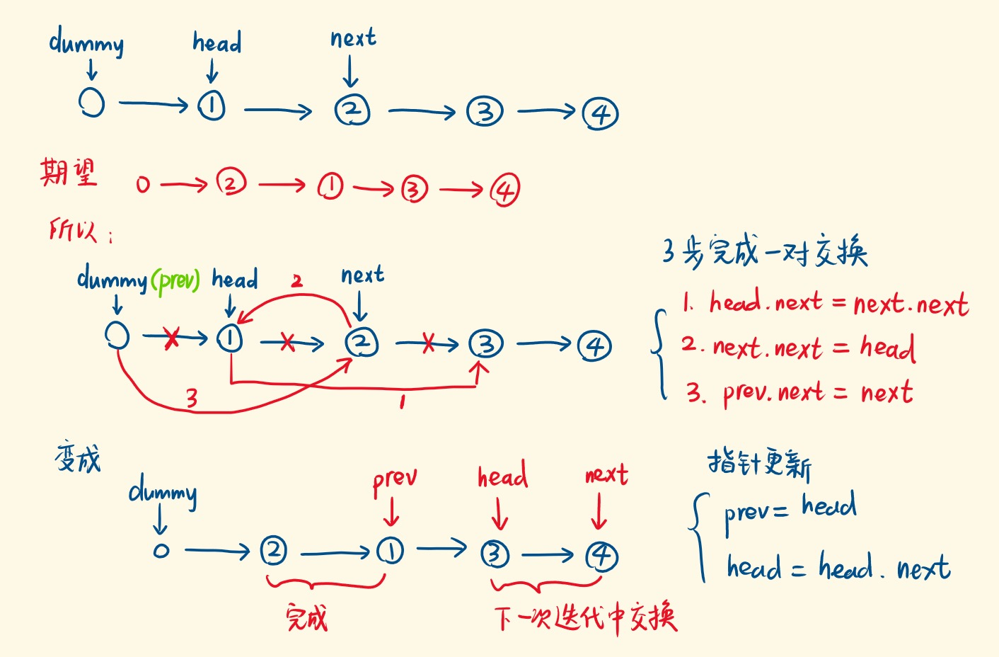

# 24. 两两交换链表中的节点

## 题目

给定一个链表，两两交换其中相邻的节点，并返回交换后的链表。

`注意`: 你不能只是单纯的改变节点内部的值，而是需要实际的进行节点交换。

 
## 示例
* 示例 1:
```text
输入：head = [1,2,3,4]
输出：[2,1,4,3]
```

* 示例 2:
```text
输入：head = []
输出：[]
```

* 示例 3:
```text
输入：head = [1]
输出：[1]
```

## 思路

### 1.三步一换
* 设置虚拟头结点 `dummy`，因为真实头结点要换人，设置了 `dummy` 后，`dummy.next` 就能找到头结点。
* 开启 `while` 循环，一对结点的交换有三个指针要改变，见下图。
    * 指针推进，准备交换下一对结点。
    * 最后返回 `dummy.next`
    

