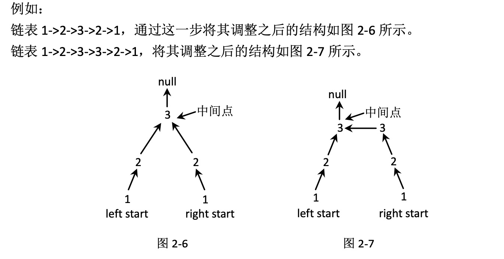

# 判断一个链表是否为回文结构

## 题目
给定一个链表的头节点 head，请判断该链表是否为回文结构。 例如:
```
1->2->1，返回 true。
1->2->2->1，返回 true。
15->6->15，返回 true。
1->2->3，返回 false。
```

## 进阶:
如果链表长度为 N，时间复杂度达到 O(N)，额外空间复杂度达到 O(1)。

## 难度
* 普通解法: 1颗星
* 进阶解法: 2颗星

## 解题思路

### 方法一: 节点全部压入栈

* Step 1: 从左到右遍历链表，遍历的过程中把每个节点依次压入栈中。

* Step 2: 因为栈是先进后出的，所以在遍历完成后，从栈顶到栈底的节点值出现顺序会与原链表从左到右的值出现顺序反过来。

那么，如果一个链表是回文结构，逆序之后，值出现的次序还是一样的，如果不是回文结构，顺序就肯定对不上。

例如:
```
链表 1->2->3->4，从左到右依次压栈之后，从栈顶到栈底的节点值顺序为 4，3，2，1。两 者顺序对不上，所以这个链表不是回文结构。
链表 1->2->2->1，从左到右依次压栈之后，从栈顶到栈底的节点值顺序为 1，2，2，1。两 者顺序一样，所以这个链表是回文结构。
```

### 方法二: 右边节点压入栈

#### 思想: 把整个链表的右半部分压入栈中，压入完成后，再检查栈顶到栈底值出现的顺序是否和链表左半部分的值相对应。

* Step 1: 找到链表的中间节点。

> 首先假设链表的长度为 N:
> * 如果 N 是偶数，前 N/2 的节点叫 作左半区，后 N/2 的节点叫作右半区。
> * 如果 N 是奇数，忽略处于最中间的节点，还是前 N/2 的 节点叫作左半区，后 N/2 的节点叫作右半区。

例如:

```
链表 1->2->2->1，左半区为:1，2;右半区为:2，1。
链表 1->2->3->2->1，左半区为:1，2;右半区为:2，1。
```

例如:
```链表 1->2->2->1，链表的右半部分压入栈中后，从栈顶到栈底为 1，2。链表的左半部分也 是 1，2。所以这个链表是回文结构。
链表 1->2->3->2->1，链表的右半部分压入栈中后，从栈顶到栈底为 1，2。链表的左半部分 也是 1，2。所以这个链表是回文结构。
链表 1->2->3->3->1，链表的右半部分压入栈中后，从栈顶到栈底为 1，3。链表的左半部分 也是 1，2。所以这个链表不是回文结构。
```


### 方法三: 有限几个变量完成判断
* Step 1: 改变链表右半区的结构，使整个右半区反转，最后指向中间节点。 
  
例如:
链表 1->2->3->2->1。 链表 1->2->3->3->2->1，将其调整之后的结构如图 2-7 所示。



> 我们将左半区的第一个节点(也就是原链表的头节点)记为 leftStart，右半区反转之后最右边的节点(也就是原链表的最后一个节点)记为 rightStart。
* Step 2: leftStart 和 rightStart 同时向中间点移动，移动每一步时都比较 leftStart 和 rightStart 节点 的值，看是否一样。如果都一样，说明链表为回文结构，否则不是回文结构。
* Step 3: 不管最后返回的是 true 还是 false，在返回前都应该把链表恢复成原来的样子。
* Step 4:链表恢复成原来的结构之后，返回检查结果。
 