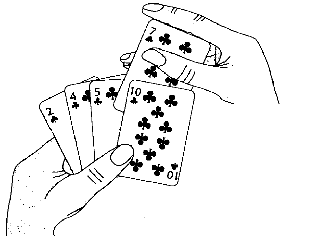

# 插入排序

## 插入排序思路
**原理: 有序数组 + 待排序的元素(将要排序的元素插入到有序数组的正确位置)**

从整个待排序列中选出一个元素插入到已经有序的子序列中去，得到一个有序的、元素加一的子序列，直到整个序列的待插入元素为0，则整个序列全部有序。

### 插入方法1: 和前面有序数组每个值进行交换
在从后向前扫描过程中，需要反复把已排序元素逐步向后挪位，为最新元素提供插入空间。

### 插入方法2: 前面有序数组大于插入的值往后移1位，然后找到位置后再插入
针对方法1的这个排序算法改进:

首先上面的这个每次替换都要定义一个temp赋值需要插入的数，这样会造成不必要的浪费：

所以:
* 把所有的大于需要插入的数先保存，然后进行比较
* 然后将最后的正确位置空出来
* 把之前保存的需要插入的数放到正确位置上

## 插入排序分析

| 分析维度 | 分析结果 |
|----|----|
| 平均时间复杂度 | `O(N^2)` |
| 最优时间复杂度 | `O(N)` |
| 最坏时间复杂度 | `O(N^2)` |
| 额外空间复杂度 | `O(1)` |
| 是否稳定 | 是 |
