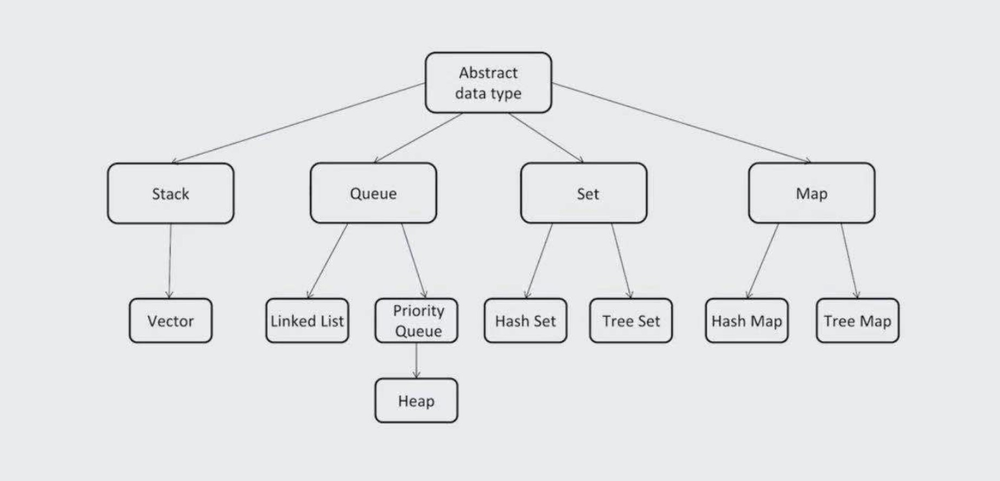

# 1. 数据结构和算法介绍

## 1.1 数据结构
* `Array`: 数组
* `Stack`/`Queue`: 栈/队列
* `PriorityQueue`: 优先队列
* `LinkedList`: 链表
* `Queue`/`PriorityQueue`: 队列/优先队列
* `Tree`/`Binary Search Tree`: 树/二分搜索树
* `HashTable`: 哈希表
* `Disjoint Set`: 并查集
* `Trie`: 字典树
* `BloomFilter`: 布隆过滤器
* `LRU Cache`: 最近最少使用缓存

## 1.2 算法
* `Greedy`: 贪婪算法
* `Recursion`: 递归
* `Backtrace`: 回溯
* `Traversal`: 遍历
* `Breadth-first`/`Depth-first Search`: 广度、深度查找
* `Divide and Conquer`: 分治
* `Dynamic Programming`: 动态规划
* `Graph`: 图算法
