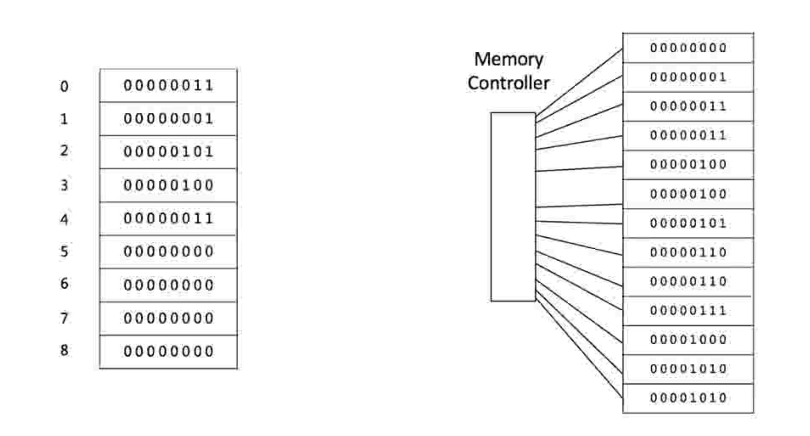
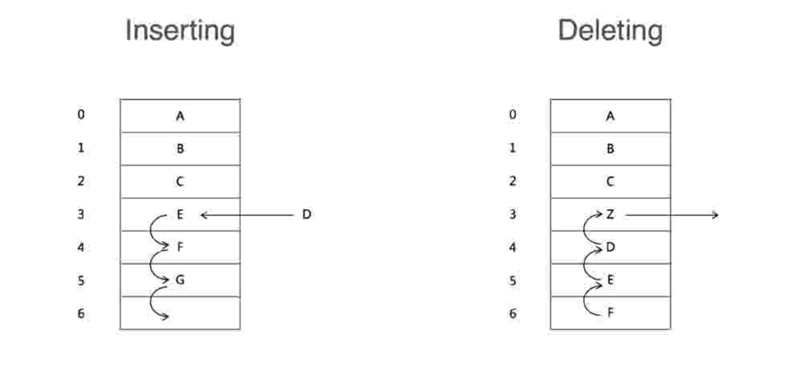

# 3. 数组

## 3.1 数组的概念
数组是内存里 **一段连续的内存区域**。

如下图:

## 3.2 数组的操作

### 查找
数组是连续的，是连续的内存块，所以查询只需要耗费O(1)的时间。

数组的查找: O(1)

### 插入
由于数组是连续的，所以在插入D的时候，E、F、G都要往后挪一位。

* 最坏的时间复杂度是 O(n)
* 最好的时间复杂度 O(1)

平均时间复杂度: O(n/2)=O(n)

### 删除
同插入的原理。

时间复杂度: O(n)
