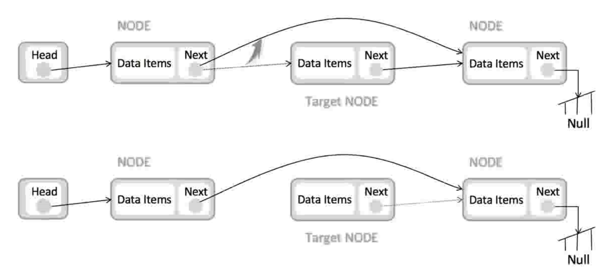

# 4. 链表
## 4.1 链表的种类
### 单向链表
* `next` 指针: 指向后一个元素

  
每个元素有一个指针

### 变形单向链表
在单向链表基础上，新增了 头指针 和 尾指针。

### 双向链表
每个元素有2个指针:
* `next` 指针: 指向后1个元素
* `previous` 指针: 指向前1个元素

  

## 4.2 链表的操作

### 查找元素
时间复杂度: O(n)

从头指针开始一个一个查找

### 插入元素
时间复杂度: O(1)
* 找到插入的位置
* 新节点 next指向要插入的位置元素前面
* 将前面元素的指针，指向新节点

### 删除元素
时间复杂度: O(1)
* 删除元素的前面1个元素 的next指针，直接指向被删除的后一个元素
* 将被删除的元素从内存中释放掉

## 4.3 数组 & 链表练习题
* [206.反转链表](https://leetcode-cn.com/problems/reverse-linked-list/)
* [24.两两交换链表中的节点](https://leetcode-cn.com/problems/swap-nodes-in-pairs/)
* [141.环形链表](https://leetcode-cn.com/problems/linked-list-cycle/)
* [142.环形链表ii](https://leetcode-cn.com/problems/linked-list-cycle-ii/)
* [25.K个一组翻转链表](https://leetcode-cn.com/problems/reverse-nodes-in-k-group/)
